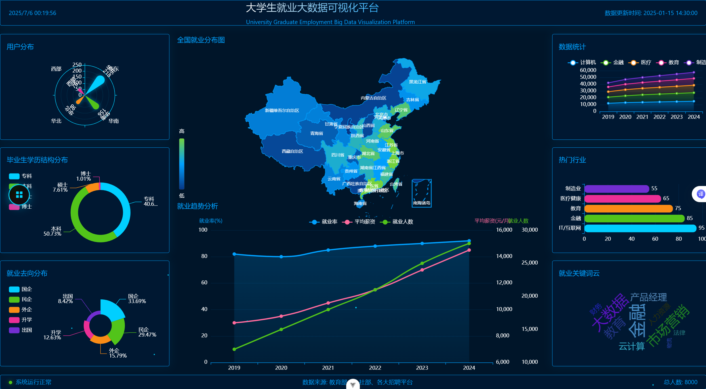

# 大学生就业大数据分析平台

## 项目概述

本项目是一个基于大数据技术栈构建的大学生就业数据分析平台，旨在通过数据采集、处理、分析和可视化，为高校就业指导提供数据支持和决策参考。项目采用前后端分离架构，结合Spark大数据处理能力，实现就业数据的多维度分析与展示。


## 技术架构

### 整体架构
- **前端**：Vue 3 + TypeScript + Element Plus + ECharts
- **后端API**：Spring Boot + MyBatis-Plus + MySQL
- **大数据处理**：Spark 3.2.3 + Scala 2.13 + Hadoop
- **构建工具**：Maven (后端)、npm (前端)

### 模块划分
```
college-employment-analysis/
├── employment-api/        # 后端API服务
├── employment-front/      # 前端可视化平台
└── employment-spark-job/  # 大数据处理
```

## 功能特点

1. **数据采集与处理**
   - 基于Spark SQL进行就业数据清洗与转换
   - 支持多源数据整合（数据库、文件等）
   - 定时任务调度数据更新

2. **数据分析能力**
   - 就业趋势分析与预测
   - 行业分布与薪资水平统计
   - 毕业生竞争力评估模型

3. **可视化展示**
   - 响应式数据仪表盘
   - 多维度图表展示（折线图、柱状图、饼图等）
   - 数据下钻与交互分析


.png)
.png)
.png)
.png)
.png)
.png)
.png)

## 快速开始

### 环境要求
- JDK 1.8+ 
- Scala 2.13.x
- Node.js 16.0.0+
- MySQL 8.0+
- Spark 3.2.3
- Maven 3.6+

### 构建与启动

#### 1. 克隆项目
```bash
git clone https://github.com/hxy180/college-employment-analysis
cd college-employment-analysis
```

#### 2. 后端构建
```bash
# 构建所有模块
mvn clean package -Dmaven.test.skip=true

# 启动API服务
cd employment-api/target
java -jar employment-api-1.0.0.jar
```

#### 3. 前端构建
```bash
cd employment-front
npm install
npm run dev
```

#### 4. 大数据分析运行
```bash
cd employment-spark-job
mvn clean package
spark-submit --class com.shixun.JobMain target/employment-spark-job-1.0.0.jar
```

## 模块详情

### employment-api
后端RESTful API服务，基于Spring Boot构建，提供：
- 用户认证与授权
- 就业数据CRUD接口
- 数据分析结果查询
- 预测模型服务接口

核心技术：
- Spring Boot 2.7.18
- MyBatis-Plus 3.5.5
- MySQL 8.0.30
- Smile 2.6.0 (机器学习库)

### employment-front
前端可视化平台，基于Vue 3构建，主要功能：
- 数据概览仪表盘
- 深度分析报告
- 就业趋势预测
- 用户管理与权限控制

核心技术：
- Vue 3 + TypeScript
- Element Plus UI组件库
- ECharts 5.6.0 (数据可视化)
- Pinia (状态管理)
- Vue Router 4.5.1

### employment-spark-job
大数据处理模块，基于Spark构建，负责：
- 原始数据清洗与转换
- 多维度数据聚合分析
- 历史数据归档
- 批量数据导入导出

核心技术：
- Spark SQL 3.2.3
- Hadoop 3.3.0
- Scala 2.13
- MySQL 5.1.32 (数据存储)

## 项目团队
- 大数据实训无敌组-xyhou
- 有任何问题请联系邮箱：houxiaoyu0106@qq.com

## 许可证
[MIT](LICENSE)

